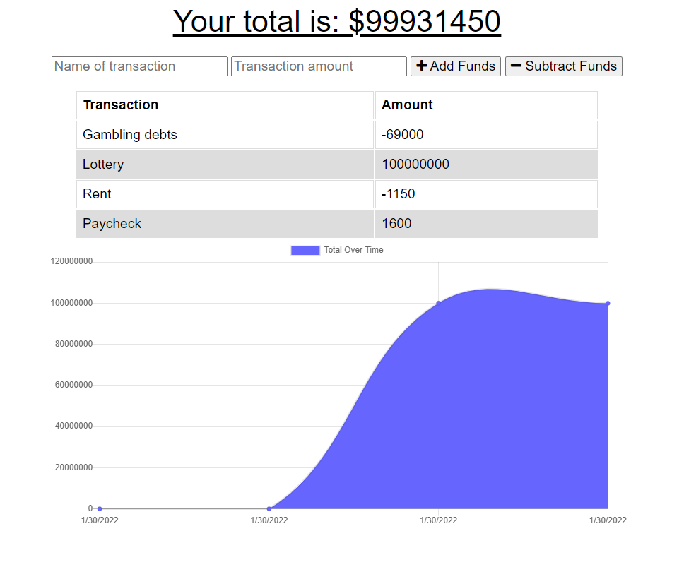

# Budget Tracker for Traveling

## Description

A budget-tracking app designed with frequent travelers in mind. The application allows users to add both expenses and income, letting travelers track their expenses throughout their journeys. It functions both on- and offline, caching files so that users can still access the application without a connection. Using IndexedDB, users' submitted transactions are stored locally if there is no connection; once the user's client reconnects to the web, locally stored data is automatically uploaded and then purged from local storage. The app has also been designed as a PWA, allowing users to install it either in their browser or onto their mobile devices.

The application was built to meet the following user story and acceptance criteria:

## User Story

```
AS AN avid traveler
I WANT to be able to track my withdrawals and deposits with or without a data/internet connection
SO THAT my account balance is accurate when I am traveling
```

## Acceptance Criteria

```
GIVEN a budget tracker without an internet connection
WHEN the user inputs an expense or deposit
THEN they will receive a notification that they have added an expense or deposit
WHEN the user reestablishes an internet connection
THEN the deposits or expenses added while they were offline are added to their transaction history and their totals are updated
```

## Built With

-   HTML
-   CSS
-   JavaScript
-   Node.js
-   Express
-   MongoDB
-   Mongoose
-   Heroku

## Deployed Application

[Heroku Deployment](https://pure-refuge-57011.herokuapp.com/)

## Screenshot


